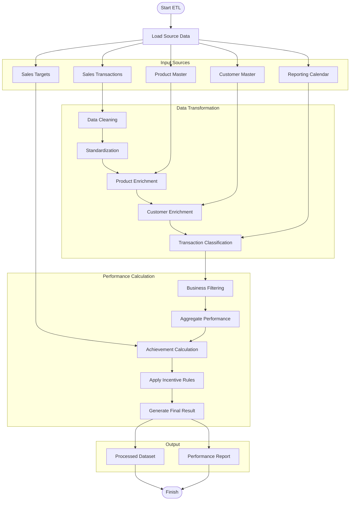

# Sales Incentive ETL Pipeline

An automated ETL pipeline for processing sales transaction data, enriching it with reference data, calculating sales performance, and generating incentive reports based on configurable business rules.

---

# Business Problem

Sales incentive calculations require transaction data from multiple operational systems to be consolidated, validated, enriched, and transformed before they can be used for performance evaluation.

Traditionally, these activities are performed manually using spreadsheets, creating several challenges:

- Time-consuming data preparation
- High risk of manual errors
- Inconsistent master data
- Difficulties handling transaction adjustments
- Slow reporting process
- Limited scalability for increasing transaction volumes

This ETL pipeline automates the complete workflow, producing reliable and analytics-ready datasets for incentive reporting.

---

# Solution

This project automates the complete incentive calculation process by:

- Loading transaction and reference datasets
- Cleaning and validating transaction data
- Standardizing customer and sales organization information
- Enriching data using multiple reference tables
- Classifying transaction types
- Calculating sales achievement
- Applying configurable incentive rules
- Generating reporting-ready outputs

---

# ETL Architecture



---

# Features

## Data Processing

- Automated ETL workflow
- Data cleaning and validation
- Date standardization
- Customer normalization
- Product enrichment
- Sales organization mapping
- Transaction classification
- Business rule transformation
- Performance aggregation
- Incentive calculation
- Automated report generation

---

## Data Enrichment

- Customer information
- Product hierarchy
- Sales organization
- Reporting calendar
- Performance targets
- Reference data integration

---

## Data Quality

- Missing value handling
- Invalid record filtering
- Duplicate handling
- Standardized output
- Data consistency validation

---

# Workflow

1. Load transaction data.
2. Load reference datasets.
3. Clean and validate source data.
4. Standardize business attributes.
5. Enrich transactions using reference data.
6. Classify transaction types.
7. Aggregate sales performance.
8. Calculate achievement metrics.
9. Apply configurable incentive rules.
10. Generate reporting datasets.

---

# Project Structure

```text
project/
│
├── raw/
├── master/
├── output/
├── config/
├── script/
│
├── etl_pipeline.py
└── run_pipeline.bat
```

---

# Requirements

```bash
pip install pandas openpyxl numpy
```

---

# Output

The ETL pipeline generates:

| Output | Description |
|----------|-------------|
| Processed Dataset | Clean and enriched transaction data |
| Achievement Report | Aggregated sales performance |
| Incentive Report | Final incentive calculation |

---

# Main Transformations

- Data cleaning
- Customer normalization
- Product mapping
- Sales organization mapping
- Transaction classification
- Performance aggregation
- Achievement calculation
- Business rule transformation
- Incentive calculation
- Final report generation

---

# Technologies

| Category | Technology |
|-----------|------------|
| Language | Python |
| Data Processing | Pandas |
| Excel Processing | OpenPyXL |
| Numerical Processing | NumPy |
| ETL | Extract, Transform, Load |

---

# Skills Demonstrated

- ETL Development
- Data Engineering
- Data Cleaning
- Data Transformation
- Data Validation
- Data Integration
- Business Rule Implementation
- Performance Reporting
- Python Automation
- Pandas
- Excel Automation

---

# Future Improvements

- Configuration using YAML
- Logging framework
- Automated testing
- Incremental processing
- Database integration
- Workflow orchestration (Apache Airflow)
- Docker containerization
- CI/CD pipeline
- Data quality monitoring

---

# Disclaimer

This repository demonstrates the ETL architecture and data processing workflow only.

To protect confidential business information:

- No proprietary datasets are included.
- All configuration values have been anonymized.
- Business rules have been generalized.
- Reference data has been abstracted.
- Sample data (if provided) is fictional or anonymized.

---

# Author

Developed as a personal Data Engineering portfolio project demonstrating ETL automation, data transformation, performance calculation, and reporting pipeline development.